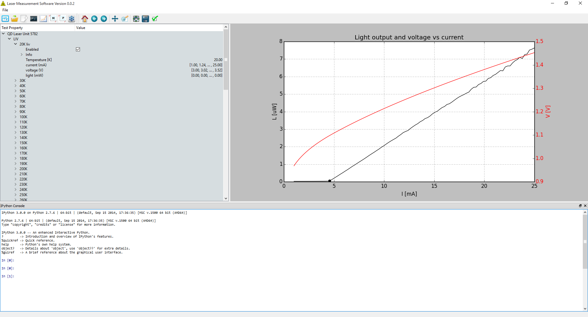

# pylase
Extensible python software that I've used for automating measurements of LIV curves and lasing spectra of semiconductor lasers during my PhD research. 

Here are some of it's other capabilities:
* Pyqt GUI for easily plotting and switching between different measurement data
* Data stored in convenient HDF5 heirarchical database that can be read directly by almost any scientific software
* Embedded iPython terminal that you can use to do custom data manipulation and plotting
* Hakki-Paoli gain spectrum measurements (requires a compatible optical spectrum analyzer)
* Control the software "Winspec" as if it were an optical spectrum analyzer (requires a compatible spectrometer and camera) [Windows only]
* Temperature sweeps (requires a compatible temperature controller)
* Semi-automatic optical alignment (requires a compatible flexure stage)

This software is intended to be used together with my library of python drivers for communicating with scientific instruments called "drivepy". It's provided entirely as-is with the hope that someone somewhere finds it useful.

# Installation instructions
On Windows it's highly recommended to use the Enthought Canopy Distribution. On Linux you'll probably want to create a virtual environment.

The following packages (and their dependencies) are necessary to start the software:

* PyQt4
* Ipython 4.x+
* qtconsole   
* numpy
* scipy
* matplotlib
* tables (AKA pytables)

Once the dependencies are installed you'll need to build the resources with the command `pyrcc4 -o qrc_resources.py resources.qrc`, after which you should be able to start the app by running `python main.pyw` from a terminal.

To actually make measurements you'll also need some wrapper code for your measurement instruments that implements the expected interfaces for an SMU, Power Meter, and Spectrum Analyzer.
The app is currently harcoded to use the specific instruments in my hardware setup, the wrappers for which are in a separate package called [drivepy](https://github.com/timrae/drivepy). 
Modifications to the source code in measurement.py will be necessary if you want to make measurements with anything other than the exact same hardware setup that I used.
